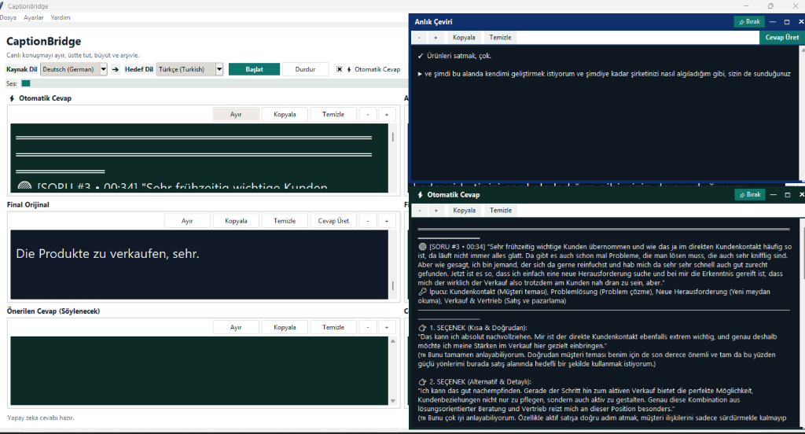
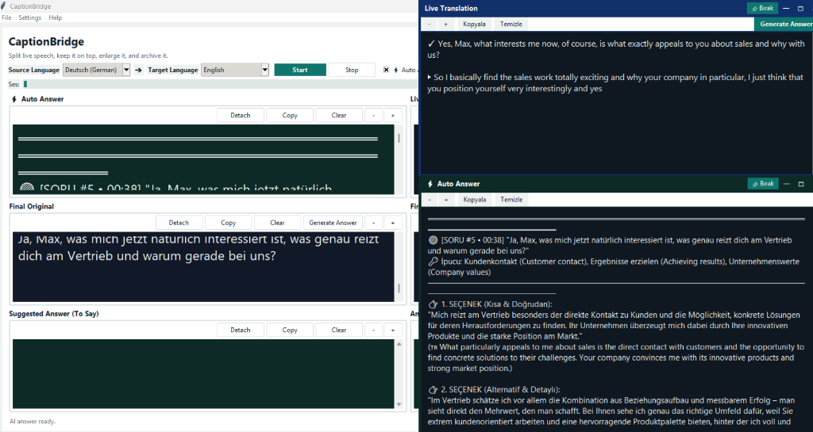

# CaptionBridge 🎙️🌐

[](https://github.com/Aristotheles/CaptionBridge/releases)
[](https://github.com/Aristotheles/CaptionBridge)
[](https://www.python.org/)
[](LICENSE)

**CaptionBridge**, Windows ortamında çalışan; düşük gecikmeli canlı konuşma yakalama, eşzamanlı çeviri ve **Google Gemini** destekli gerçek zamanlı akıllı mülakat/toplantı koçluğu sağlayan yeni nesil bir masaüstü asistanıdır.

[English](#english) | [Türkçe](#türkçe) | [Yasal Uyarı & Etik Kullanım](#-yasal-uyarı--etik-kullanım-bildirimi) | [Legal & Ethical Disclaimer](#-legal-disclaimer--ethical-use-policy)

---

## 📸 Ekran Görüntüleri / Screenshots

### Türkçe Ana Arayüz & Ayrılabilir Pencereler (Turkish UI & Detached Panels)


### İngilizce Ana Arayüz (English UI)


---

## Türkçe

### 🌟 v1.1.0 ile Gelen Yenilikler ve Özellikler

#### ⚡ 1. Gerçek Zamanlı Otomatik Cevap Motoru (Zero-Click Auto Answer)
- Karşı taraf konuştuğunda (Azure konuşmayı tamamladığı an) sistem soruyu veya konuşma akışını otomatik olarak algılar.
- Herhangi bir butona basma gecikmesi olmadan Gemini arka planda devreye girer ve **2 farklı doğal konuşma seçeneği** ve Türkçe çevirilerini anında hazırlar.

#### 🟢 2. Canlı Prompter Formatı & Latest-on-Top Akışı
- **En Son Soru En Üstte:** Gelen her yeni soru-cevap kartı otomatik olarak panelin en tepesine (`1.0`) eklenir. Aşağı kaydırma derdi biter.
- **Sıra Numarası ve Saat Damgası:** Her kart `[SORU #1 • 23:58]` şeklinde belirgin bir başlıkla açılır.
- **🔑 Kilit İpuçları (Keywords):** Sorunun hemen altında 2-3 kilit kavram yer alır; böylece konuyu 1 saniyede kavrayıp kendi cümlenizle konuşabilirsiniz.
- **Hiyerarşik Odak:** Büyük fontlu doğrudan hedef dil (Almanca/İngilizce) cümlesi en üstte, Türkçe çevirisi altında küçük referans olarak gösterilir.

#### 📜 3. Anlık Çeviride 2 Satırlı Kayan Tampon
- Konuşmacı 1. cümleyi bitirdiğinde çeviri ekrandan kaybolmaz (`✓ 1. Cümle`).
- 2. cümle başladığında alt satırda canlı akar (`▶ 2. Cümle`). 2. cümle tamamlandığında 1. cümle yerini 2'ye bırakır.

#### 🪟 4. 8 Yönlü Serbest Boyutlandırılabilir & Sabitlenebilir Pencereler
- 6 modülün tamamı bağımsız yüzen pencerelere ayrılabilir.
- Pencereler işletim sisteminin çift başlık çubuğundan arındırılmış olup, **8 yönden (sağ, sol, üst, alt ve 4 köşe)** serbestçe boyutlandırılabilir.
- **`[📌 Sabitle]` / `[📌 Bırak]`** butonu ile Zoom/Teams toplantısının üstünde kilitli tutulabilir.

#### ⚙️ 5. Sekmeli Modern Ayarlar Penceresi & Menü Çubuğu
- Ekran karmaşası kaldırılarak sekmeli ayarlar modalına taşındı:
  - **Azure & Dil:** API Key, Bölge, Ön Kontrol, Canlı Ses Testi, Harcama linki.
  - **Ses & Giriş:** Yakalama Modu (Sistem Sesi / Sanal Aygıt / Mikrofon), Cihaz Testi, Debug Audio.
  - **Yapay Zeka (Gemini):** Gemini Key, Model seçimi (`gemini-3.6-flash`), **Gemini Test** bağlantı butonu ve Aday Tanıtım Profili.
- **Dosya Menüsü:** Konuşma geçmişini JSON/TXT olarak içe ve dışa aktarma (Import/Export).

---

## ⚖️ Yasal Uyarı & Etik Kullanım Bildirimi

> [!IMPORTANT]
> **CaptionBridge**, kullanıcıların yabancı dillerdeki canlı toplantılarda dil bariyerini aşmalarına, işitme/anlama güçlüklerini gidermelerine, toplantı notlarını takip etmelerine ve profesyonel görüşmelere hazırlanmalarına yardımcı olmak amacıyla geliştirilmiş bir **iletişim destek ve eğitim aracıdır**.

1. **Etik Kullanım:** Bu yazılım kesinlikle yetkinlikleri sahte biçimde beyan etmek, sınav/mülakat komisyonlarını aldatmak veya haksız avantaj sağlamak amacıyla tasarlanmamıştır. Adayların konuşma pratiği yapması ve fikir geliştirmesi için bir kılavuzdur.
2. **Gizlilik ve Rıza (KVKK / GDPR / Two-Party Consent):** Toplantılarda ve üçüncü şahıslarla yapılan sesli görüşmelerde ses yakalama veya çeviri yaparken, bulunduğunuz ülkenin kişisel verilerin korunması kanunlarına (KVKK, GDPR vb.) ve karşı tarafın bilgilendirilmiş rıza şartlarına uymak tamamen kullanıcının yasal sorumluluğundadır.
3. **Sorumluluk Reddi:** Yazılımın üçüncü şahıslara veya kurallara aykırı kullanımından doğabilecek hukuki, idari veya mesleki sorumluluklar tamamen kullanıcıya aittir; geliştiriciler herhangi bir sorumluluk kabul etmez.

---

## 🔒 Güvenlik & IT Risk Analizi (Top 10 Güvenlik Önlemleri)

CaptionBridge, yaygın kurumsal IT ve siber güvenlik risklerine karşı şu önlemlerle geliştirilmiştir:

1. **Kimlik Bilgisi ve API Anahtarı İfşası (Hardcoded Secrets):** Kaynak kodlarda veya repoda hiçbir API anahtarı tutulmaz. Anahtarlar kullanıcının yerel Windows `%LOCALAPPDATA%` dizininde saklanır ve `.gitignore` ile korunur.
2. **Komut ve Kod Enjeksiyonu (Injection Attacks):** Yapay zeka çıktısı dinamik kod (`eval`/`exec`) olarak çalıştırılmaz; yapılandırılmış JSON şemasıyla güvenli parse edilir.
3. **Bellek ve Kaynak Tüketimi (Resource Exhaustion / DoS):** Ses akışları ve arka plan iş parçacıkları daemon olarak yönetilir; ağ çağrılarına zaman aşımı (timeout) uygulanır.
4. **Hassas Veri Maskeleme:** Arayüzdeki API anahtarları `show="*"` maskesiyle korunur; panoya yanlışlıkla kopyalanması engellenir.
5. **İş Parçacığı Güvenliği (Thread Safety / Race Conditions):** Ağ ve ses işlemleri GUI kilitlenmelerini önlemek için `Queue` tabanlı kuyruk mimarisiyle ana Tkinter döngüsüne aktarılır.
6. **Güvenli Dosya Giriş/Çıkışı (Path Traversal Protection):** Dışa/İçe aktarım işlemleri işletim sisteminin güvenli dosya diyaloğu (`filedialog`) ile sınırlandırılmıştır.
7. **Hata İletisi Sanitizasyonu:** API hatalarında kullanıcı anahtarları loglanmaz veya ekrana basılmaz; yalnızca kullanıcı dostu hata mesajları gösterilir.
8. **Yerel İşleme Önceliği:** Ses yakalama ve seviye izleme tamamen yerel makinede çalışır. Yalnızca çeviri ve yanıt için kullanıcının kendi Azure/Gemini aboneliğine şifreli (TLS 1.3) istek atılır.
9. **Yönetici Ayrılcalığı Gerektirmez:** Program standart kullanıcı (non-admin) yetkileriyle güvenle çalışır.
10. **Güvenilir Bağımlılık Zinciri:** Yalnızca resmi Microsoft (`azure-cognitiveservices-speech`) ve Google (`google-genai`) SDK'ları kullanılır.

---

## 🚀 Kurulum & Çalıştırma

### Hazır Exe ile Çalıştırma (Kullanıcılar İçin)
1. [Releases](https://github.com/Aristotheles/CaptionBridge/releases) sayfasından **`CaptionBridge_v1.1.0_Windows_x64.zip`** dosyasını indirin.
2. ZIP dosyasını bir klasöre çıkartın.
3. `CaptionBridge.exe` dosyasını çalıştırın.

### Kaynak Koddan Çalıştırma (Geliştiriciler İçin)
```powershell
# 1. Repoyu klonlayın
git clone https://github.com/Aristotheles/CaptionBridge.git
cd CaptionBridge

# 2. Sanal ortamı kurun ve aktifleştirin
python -m venv .venv
.\.venv\Scripts\Activate.ps1

# 3. Bağımlılıkları yükleyin
pip install -e .
pip install google-genai

# 4. Uygulamayı başlatın
python run_ceviri_app.py
```

---

## English

### 🌟 Features & What's New in v1.1.0

#### ⚡ 1. Real-Time Zero-Click Auto-Answer Engine
- When speech is finalized by Azure Speech, the assistant automatically identifies questions and conversation turns.
- Generates **two distinct spoken response options** with translations in the background without requiring manual clicks.

#### 🟢 2. Live Prompter Cards (Latest-on-Top)
- **Latest-on-Top Ordering:** New question-answer pairs appear at the top (`1.0`) of the panel.
- **Turn Numbering & Time:** Every card is timestamped (e.g., `[QUESTION #3 • 00:34]`).
- **🔑 Key Bullet Hints:** 2-3 quick keywords to help formulate your own answer instantly.
- **Visual Hierarchy:** Bold spoken sentence in the target language on top, subtle native translation underneath.

#### 📜 3. Two-Line Sliding Buffer for Live Translation
- Completed sentences remain on screen (`✓ Finished sentence`).
- Incoming live speech streams on the second line (`▶ Streaming sentence`) and smoothly replaces the previous line upon completion.

#### 🪟 4. 8-Direction Resizable & Pinnable Detached Panels
- All 6 panels can be popped out into independent borderless windows.
- Resizable from any edge or corner, and can be pinned on top of Zoom/Teams with **`[📌 Pin]` / `[📌 Unpin]`**.

#### ⚙️ 5. Tabbed Settings Dialog & Top Menu Bar
- Cleaned up main screen toolbar by organizing settings into Azure, Audio Devices, and Gemini AI tabs.
- Full File Menu with JSON/TXT history Import & Export capabilities.

---

## ⚖️ Legal Disclaimer & Ethical Use Policy

> [!IMPORTANT]
> **CaptionBridge** is designed strictly as an **educational, accessibility, and communication assistance tool** to help individuals bridge language barriers, overcome hearing difficulties, and prepare for multilingual discussions.

1. **Ethical Use:** This application is not intended for deceptive practices, fraudulent misrepresentation of qualifications, or unauthorized assistance in monitored examinations.
2. **Privacy and Consent:** Users are solely responsible for ensuring compliance with applicable wiretapping, privacy, and data protection laws (e.g., GDPR, KVKK, two-party consent regulations) before capturing or processing third-party audio.
3. **Limitation of Liability:** The developers assume no liability for misuse of this software or for any legal or professional consequences resulting from its deployment.

---

### License
This project is licensed under the MIT License — see the [LICENSE](LICENSE) file for details.
